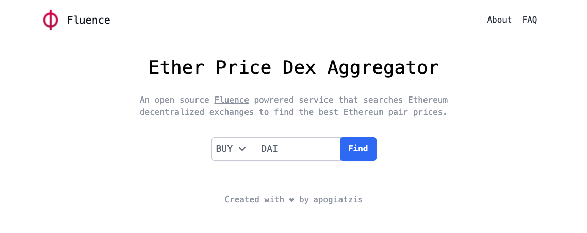

# Fluence Powered Ether Price Descovery

An open source Fluence powrered service that searches Ethereum decentralized exchanges to find the best Ethereum pair prices. 
The frontend makes use of a `curl` [Fluence service](services/curl) written in Rust to fetch ether prices from an [Airswap microservice](https://ethereum-dex-prices-service.production.airswap.io/).



## Get Started

Follow the steps below to get started with using this project. In order for the build and deployment to work properly make sure that you have the following dependencies installed on your system:

1. [Docker](https://docs.docker.com/get-docker/)
2. mrepl (`cargo install mrepl`)
2. marine (`cargo install marine`)

## Fluence

### Build

To build the wasm modules of the services run in the root folder:

```
npm run fluence-build
```

After the build process is finished, the wasm modules will appear in the [artifacts/](artifacts/) folder.

### Deploy

To deploy the fluence service amend the application config with the node id of your testnet/local/mainnet:

- [`app-local.config.json`](app-local.config.json)
- [`app-testnet.config.json`](app-testnet.config.json)
- [`app-mainnet.config.json`](app-mainnet.config.json)

and run in the root directory:

```
FLUENCE_ENV=(local | testnet | mainnet) npm run fluence-deploy
```

NOTE: Change the `FLUENCE_ENV` variable accordingly.

Here is an example application config.
```
{
    "services": {
        "curl": {
            "dependencies": ["curl"],
            "node": "12D3KooWKEprYXUXqoV5xSBeyqrWLpQLLH4PXfvVkDJtmcqmh5V3"
        }
    },
    "modules": {
        "curl": {
            "file": "artifacts/curl.wasm",
            "config": {
                "mounted_binaries": {
                    "curl": "/usr/bin/curl"
                }
            }
        }
    },
    "scripts": {},
    "script_storage": {}
}
```

Each environment deployment creates an json artifact in [ng-app/src/fluence](ng-app/src/fluence) which is loaded by the Angular application and used in the environment variables. 

### Local deployment

Note the if you want to deploy in a local node you must have a Fluence node running locally first. To launch a local node, ensure that you have docker installed and run:

```
npm run fluence-node
```

To get the peerID of your local node you can also run:

```
npm run fluence-node-peerid
```

## Angular Client

To launch the angular app navigate to `ng-app/` folder and run:

**Install dependencies** (Only need to run once)
```
npm install
```

**Launch**
```
npm start -- --configuration=testnet
```

If you use `local` configuration make sure you have a fluence nore running and you have already followed the steps above for deploying the Fluence service locally.